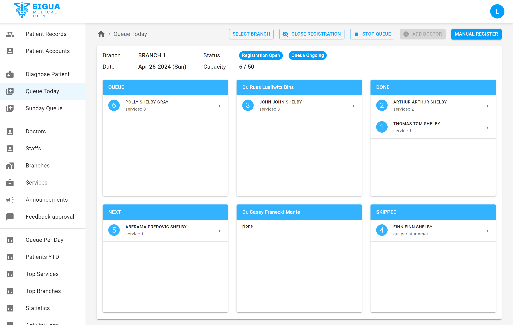
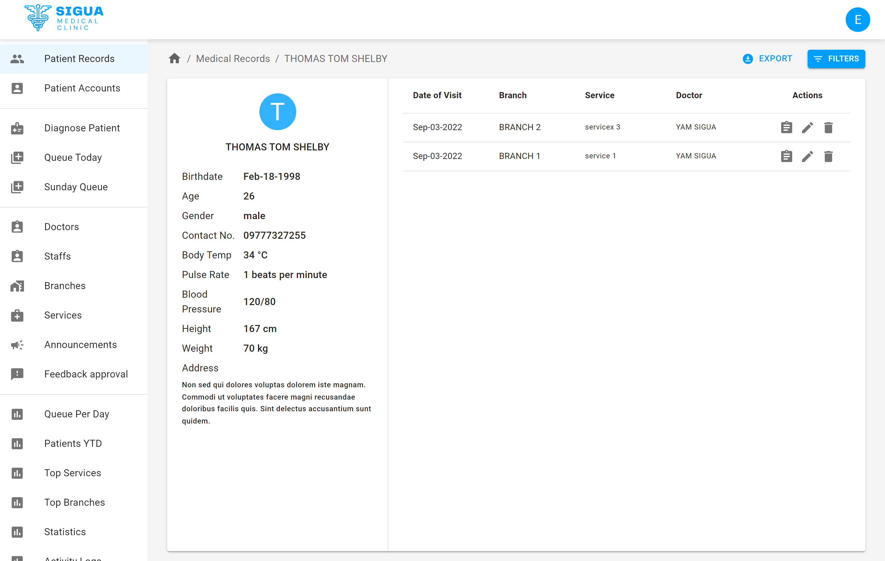
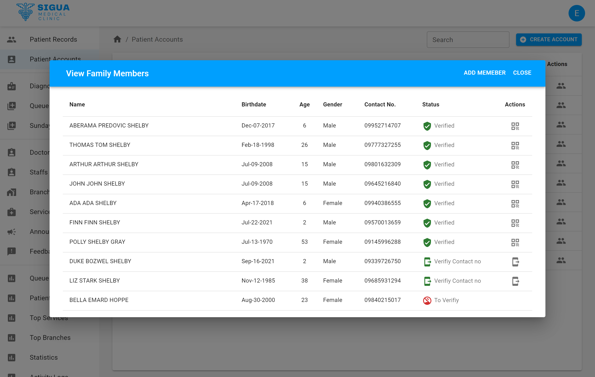
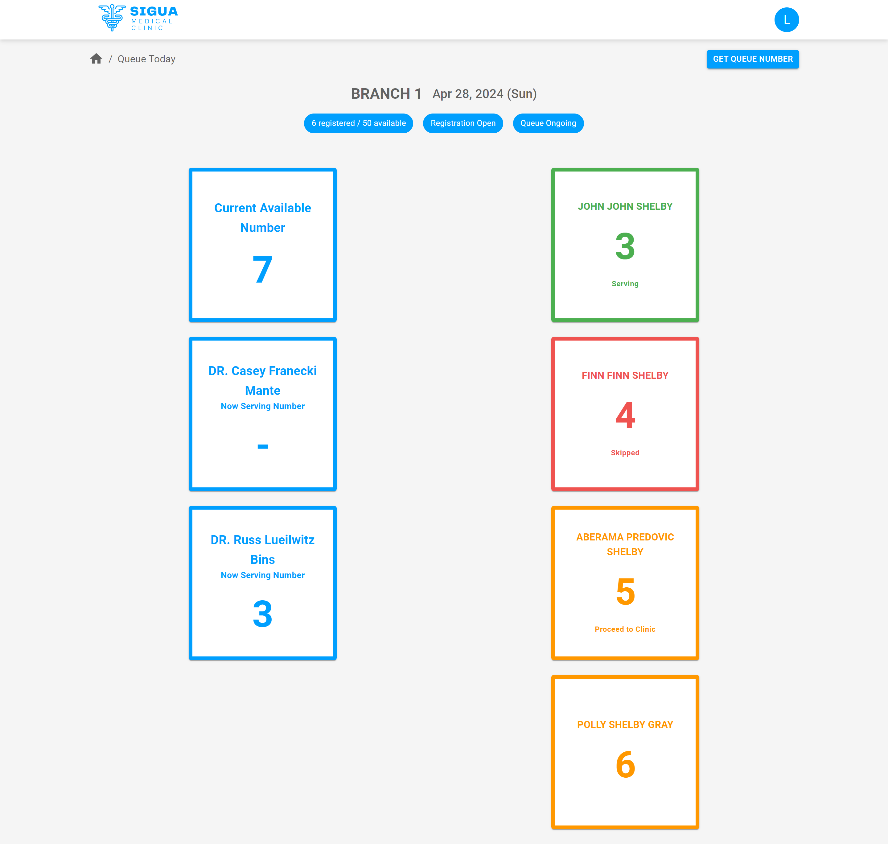
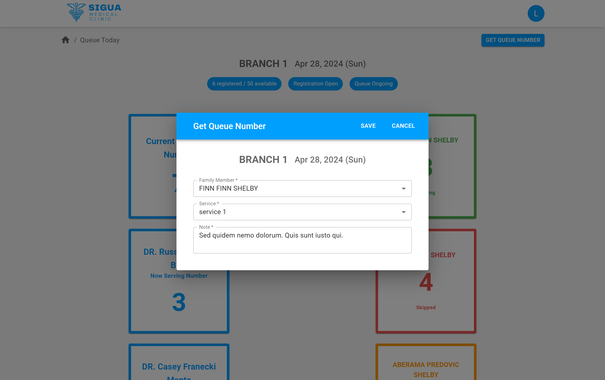

## About The Project

A Real-time queue management web application , monitoring patient flow and activities across different clinic branches. Keep patients informed with SMS notifications regarding their queue progress. Utilize comprehensive patient data management tools for historical records and generate graphical reports for comprehensive clinic and staff performance analysis.

### Built With

- ![React][React-badge]
- ![NextJS][NextJS-badge]
- ![JavaScript][JavaScript-badge]
- ![NodeJS][NodeJS-badge]
- ![Expressjs][Expressjs-badge]
- ![Firebase][Firebase-badge]
- ![SASS][SASS-badge]
- ![MUI][MUI-badge]
- Vonage (SMS provider)

## Features

#### Administrator / Doctor / Staff account

- Access and view historical medical records of patients for efficient diagnosis and treatment.
- Generation of unique QR ID for patients to expedite identification during clinic visits, streamlining the check-in process.
- Doctor Diagnosis feature to assess patient conditions and prescribe appropriate treatments.
- Doctor, Staff, Branch, and Services Management.
- Administer clinic announcements and updates for patients via the clinic portal website, enhancing communication and visibility.
- Generate comprehensive reports including daily queue statistics, top services utilized, top-performing branches, and year-to-date patient records, enabling data-driven decision-making and performance evaluation.

#### Patient account

- Family Account Integration enabling patients to add family members under one account, facilitating seamless appointment scheduling for the entire household.
- Queue Registration allowing patients to register for a queue at different branches, specifying the reason for their visit and adding any additional notes for the healthcare provider.
- Real-time Queue Monitoring provididing patients with a real-time view of the queue status, enabling them to track their position in the queue.
- SMS Queue Notifications which sends SMS notifications to patients when their queue turn is approaching, ensuring they are alerted and ready for their appointment.
- Comprehensive Medical Records Access allowing patients to view their own medical history as well as that of their entire family, including diagnosis records.

## Screenshots

### Administrator / Doctor / Staff

#### Real-time queue management

#### Patient's medical record

#### Family members per patient account

### Patient account

#### Real-time Queue Monitoring

#### Queue Registration

<!-- MARKDOWN LINKS & IMAGES -->
<!-- https://www.markdownguide.org/basic-syntax/#reference-style-links -->

[React-Query-badge]: https://img.shields.io/badge/-React%20Query-FF4154?style=for-the-badge&logo=react%20query&logoColor=white
[TypeScript-badge]: https://img.shields.io/badge/typescript-%23007ACC.svg?style=for-the-badge&logo=typescript&logoColor=white
[React-badge]: https://img.shields.io/badge/react-%2320232a.svg?style=for-the-badge&logo=react&logoColor=%2361DAFB
[Chakra-badge]: https://img.shields.io/badge/chakra-%234ED1C5.svg?style=for-the-badge&logo=chakraui&logoColor=white
[CSS3-badge]: https://img.shields.io/badge/css3-%231572B6.svg?style=for-the-badge&logo=css3&logoColor=white
[SASS-badge]: https://img.shields.io/badge/SASS-hotpink.svg?style=for-the-badge&logo=SASS&logoColor=white
[Firebase-badge]: https://img.shields.io/badge/firebase-a08021?style=for-the-badge&logo=firebase&logoColor
[Bootstrap-badge]: https://img.shields.io/badge/bootstrap-%238511FA.svg?style=for-the-badge&logo=bootstrap&logoColor=white
[JavaScript-badge]: https://img.shields.io/badge/javascript-%23323330.svg?style=for-the-badge&logo=javascript&logoColor=%23F7DF1E
[NextJS-badge]: https://img.shields.io/badge/Next-black?style=for-the-badge&logo=next.js&logoColor=white
[NodeJS-badge]: https://img.shields.io/badge/node.js-6DA55F?style=for-the-badge&logo=node.js&logoColor=white
[MUI-badge]: https://img.shields.io/badge/MUI-%230081CB.svg?style=for-the-badge&logo=mui&logoColor=white
[Expressjs-badge]: https://img.shields.io/badge/express.js-%23404d59.svg?style=for-the-badge&logo=express&logoColor=%2361DAFB
